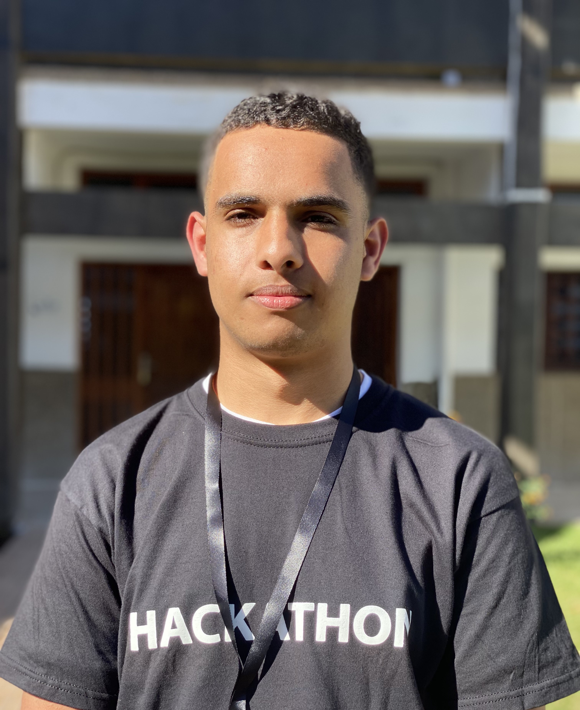

<!-- AUTO-GENERATED-CONTENT:START (STARTER) -->
<!-- ALL-CONTRIBUTORS-BADGE:START - Do not remove or modify this section -->
[](#contributors-)
<!-- ALL-CONTRIBUTORS-BADGE:END -->
<p align="center">
  <a href="https://ajincodew.netlify.app">
    
  </a>
</p>
<h1 align="center">
  Ajincodew Trainings
</h1>

Ajincodew is an Moroccan organization with the mission to empower young Moroccans by providing them with the knowledge and skills needed to excel in programming and information technology. Our commitment is to foster a vibrant tech ecosystem in Morocco and equip our youth with the tools to shape a brighter digital future.

## 🚀 Quick start

1.  **Fork and clone the project**

    ```sh
    git clone https://github.com/Aji-ncodew/Trainings

## Contributors ✨

Thanks goes to these wonderful people ([emoji key](https://allcontributors.org/docs/en/emoji-key)):

<!-- ALL-CONTRIBUTORS-LIST:START - Do not remove or modify this section -->
<!-- prettier-ignore-start -->
<!-- markdownlint-disable -->
<table>
  <tbody>
    <tr>
      <td align="center" valign="top" width="20%"><a href="https://taffah-achraf.netlify.app"><br /><sub><b>Achraf TAFFAH</b></sub></a><br /><a href="https://github.com/Aji-ncodew/trainings/commits?author=TAFFAHACHRAF" title="Code">💻</a> <a href="https://github.com/Aji-ncodew/trainings/commits?author=yjose" title="Documentation">📖</a> <a href="#content-TAFFAHACHRAF" title="Content">🖋</a> <a href="https://github.com/Aji-ncodew/trainings/pulls?q=is%3Apr+reviewed-by%3ATAFFAHACHRAF" title="Reviewed Pull Requests">👀</a></td>
    </tr>
  </tbody>
</table>

